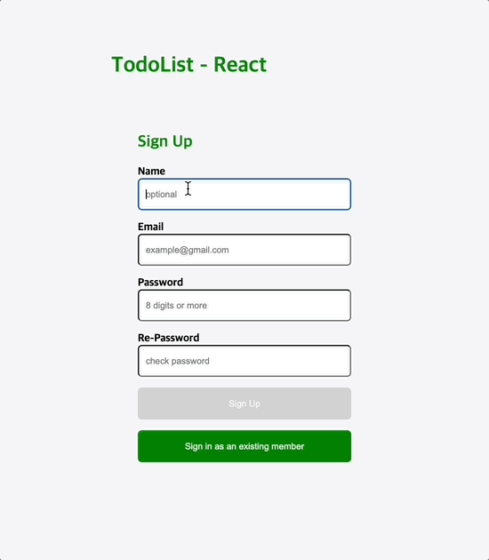
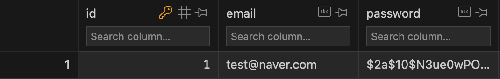
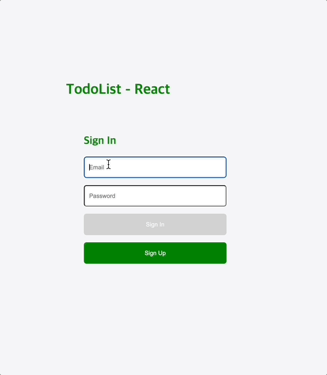
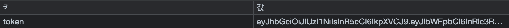
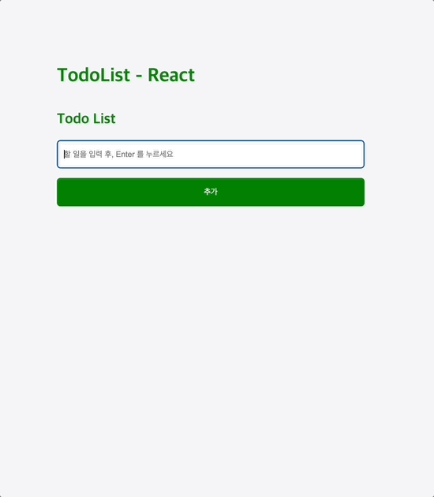
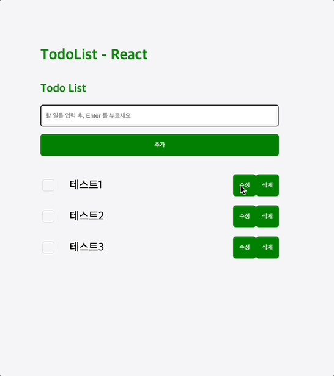
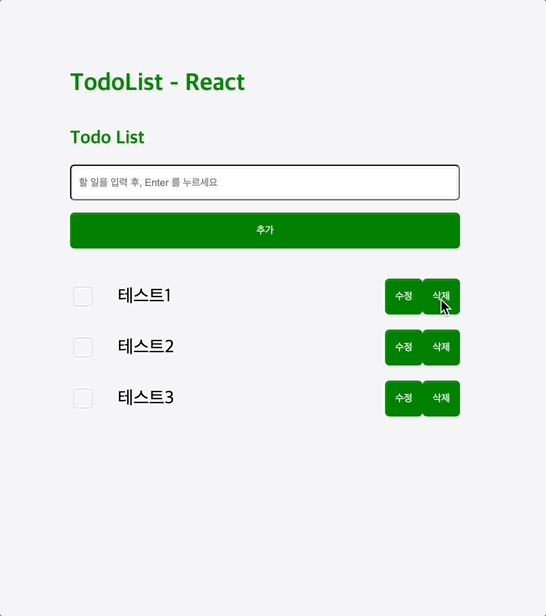
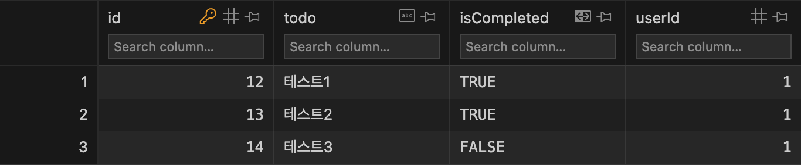

# TodoList - React

리액트 기술을 활용하여 제작하여 리액트 기술 향상을 도모하기 위한 첫 프로젝트로 TodoList를 제작했습니다.

## 🪑 참고

[원티드 프리온보딩 프론드엔드 선발과제]("https://github.com/walking-sunset/selection-task")를 참고하여 만든 프로젝트입니다.

## ⚙️ 사용 기술 및 개발 환경

-   Tools : Visual Studio Code
-   OS : macOS 13.4.1(22F82)

[Front-End]

-   Web : JavaScript, Styled-Components
-   Library : React
-   Build : CRA

[Server]

-   Local API 서버를 활용하여 실습

## ✨ 구현 내용

### SignUp

-   서버로 email, password 를 전송하여 회원가입 구현
-   이름은 생략가능하도록 구현
-   email, password 유효성 검사 구현

#### 요청

-   URL: `/auth/signup`
-   Method: `POST`
-   Headers:
    -   Content-Type: `application/json`
-   Body:
    -   email: string
    -   password: string

-   다음은 서버에 회원가입 정보가 저장된 모습이다.

### SignIn

-   서버에 저장된 회원정보를 조회해 이와 비교했을 때 가입된 회원의 정보가 들어오면 로그인되는 방식이다.
-   로그인을 성공하면 JWT 을 로컬 스토리지에 저장한다.

#### 요청

-   URL: `/auth/signin`
-   Method: `POST`
-   Headers:
    -   Content-Type: `application/json`
-   Body:
    -   email: string
    -   password: string

-   다음은 로그인을 성공하여 JWT 가 로컬 스토리지에 저장된 모습이다.

### Todo

-   투두 리스트 추가(createTodo), 불러오기(getTodos), 수정(updateTodo), 삭제(deleteTodo) 구현

#### createTodo 요청

-   URL: `/todos`
-   Method: `POST`
-   Headers:
    -   Authorization: `Bearer access_token`
    -   Content-Type: `application/json`
-   Body:
    -   todo: string

#### getTodos 요청

-   URL: `/todos`
-   Method: `GET`
-   Headers:
    -   Authorization: `Bearer access_token`

#### updateTodo 요청

-   URL: `/todos/:id`
-   Method: `PUT`
-   Headers:
    -   Authorization: `Bearer access_token`
    -   Content-Type: `application/json`
-   Body:
    -   todo: string
    -   isCompleted: boolean

#### deleteTodo 요청

-   URL: `/todos/:id`
-   Method: `DELETE`
-   Headers:
    -   Authorization: `Bearer access_token`

-   다음은 투두 리스트가 Local API 서버에 저장된 모습이다.

